## 📋 目录

- [插件说明](#插件说明)
- [注意事项](#注意事项)
- [部署方法](#部署方法)
- [插件使用](#插件使用)

## 🔌 插件说明

内置了@Malt的插件，部署完云酒馆后即可打开插件，无需额外安装。

插件贴：[Discord](https://discord.com/channels/1134557553011998840/1361327099331481621)

## ⚠️ 注意事项

- **仓库权限**：确保fork后的仓库设置为Public，Private仓库会导致HF拉取失败
  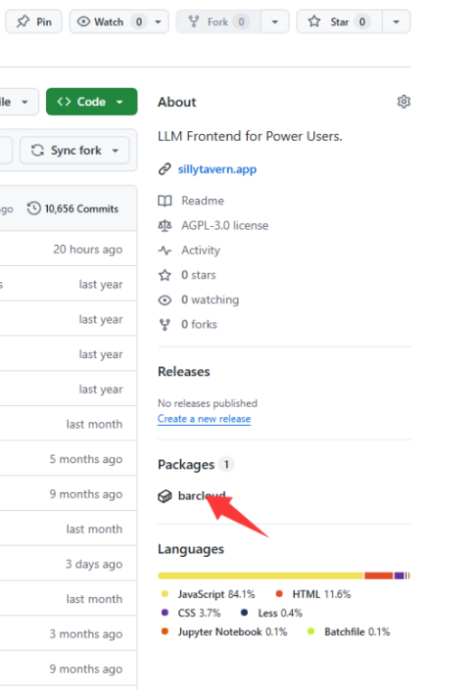
  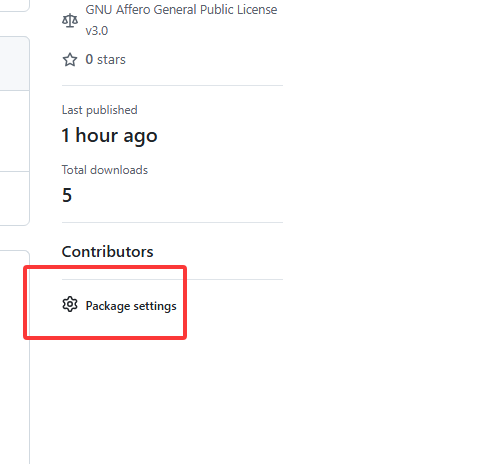
  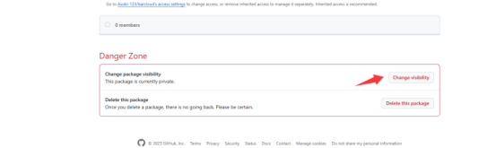

## 🚀 部署方法

### 方法一：手动部署（版本及时更新）

#### 第一步：仓库配置

1. 去fork酒馆 [https://github.com/SillyTavern/SillyTavern](https://github.com/SillyTavern/SillyTavern)，fork后的名字不要带SillyTavern类似字眼
   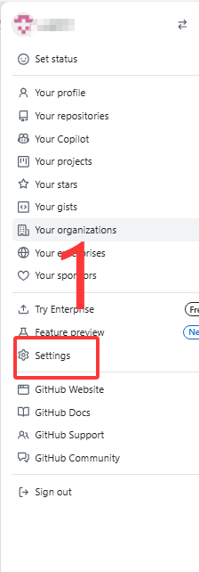
   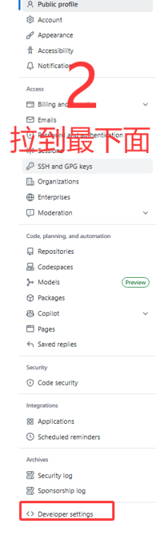
   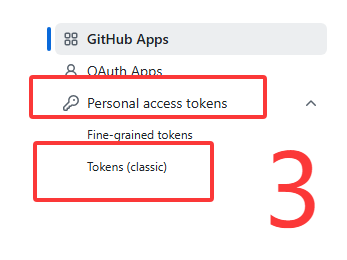
   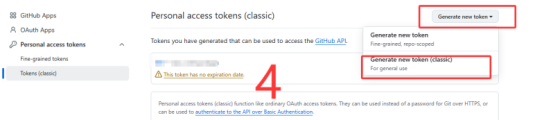
   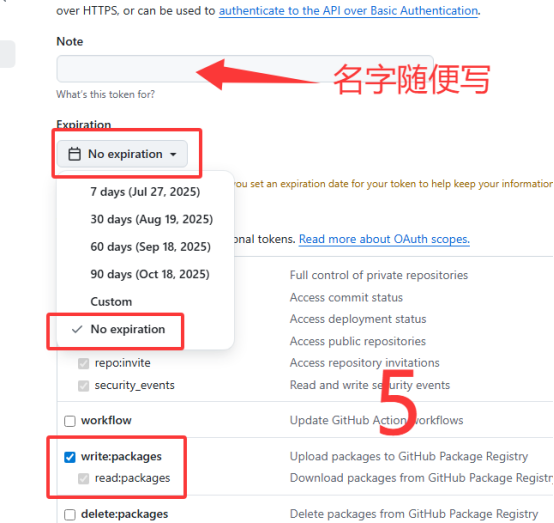
   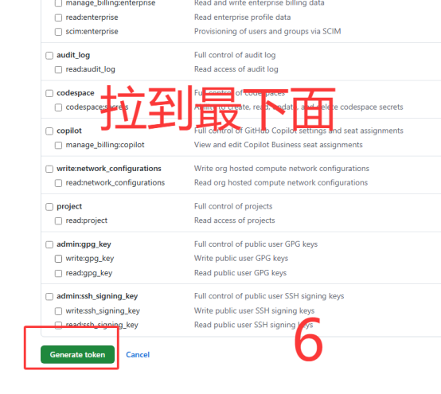
   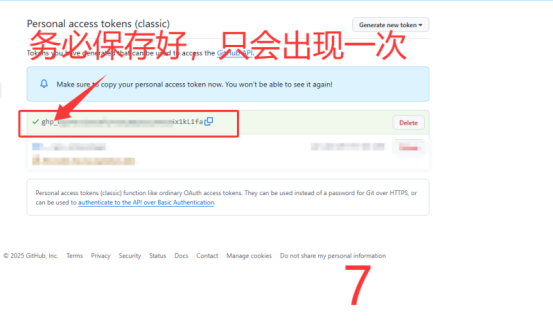

2. 打开你fork后的仓库，点击Settings，将release改为main
   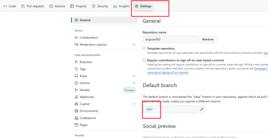

#### 配置变量GHCR_PAT

3. 点击该仓库的Actions，创建工作流，等待工作流创建完成
   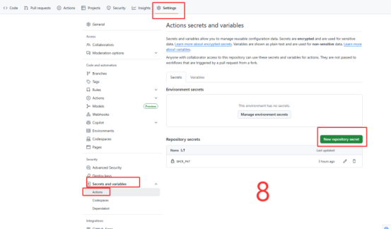
   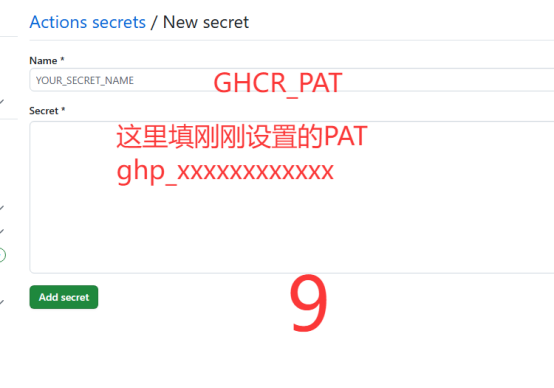
   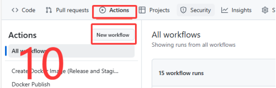
   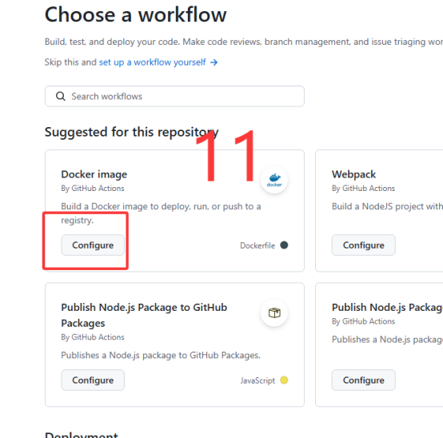
   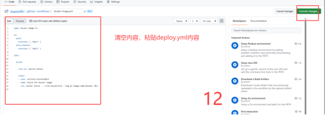

#### 第二步：HF配置

- 空间命名不要出现SillyTavern类似字眼
- 修改Dockerfile配置
1. 将修改后的Dockerfile与entrypoint.sh、config.template.yaml一起上传
2. 修改README.md，在末尾填入：
   ```yaml
   app_port: 8000
   ```
3. 配置安全变量，添加Secrets：
   - **Name**: BASIC_AUTH_USER，**Value**: 输入用户名 (例如 `admin`)
   - **Name**: BASIC_AUTH_PASS，**Value**: 输入复杂密码

等待配置完毕，酒馆启动后插件自动安装
   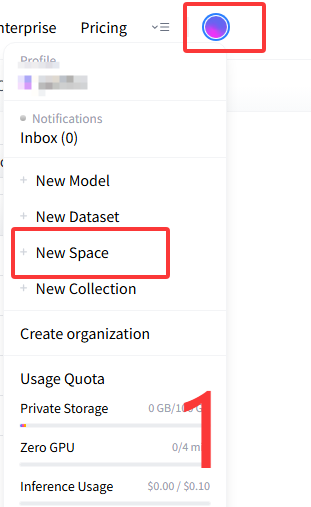
   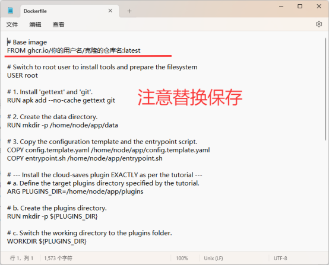
   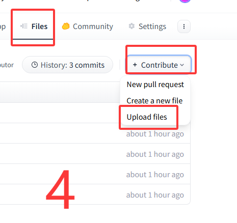
   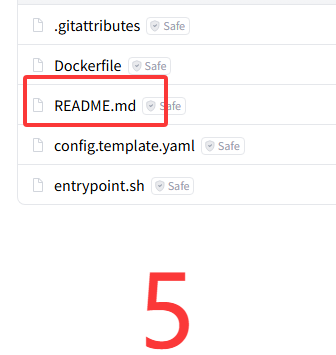
   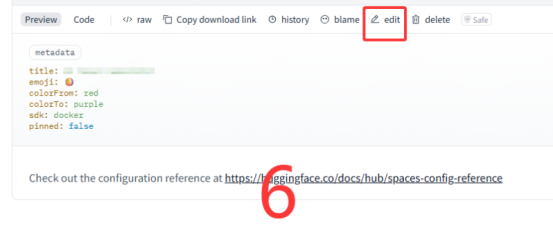
   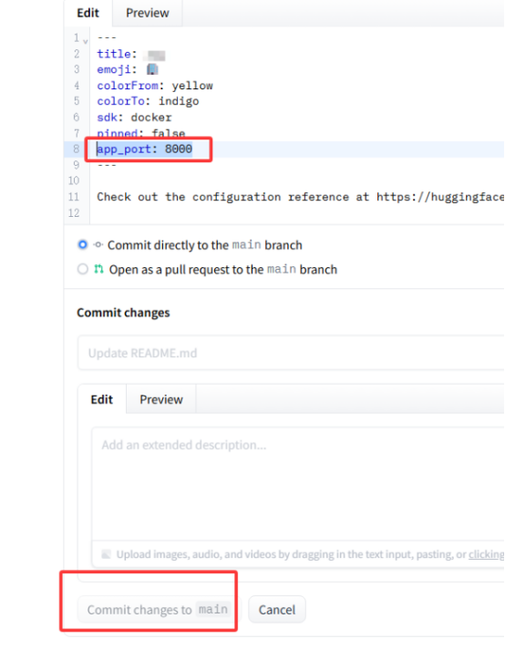

### 方法二：快速部署（版本更新延迟）

1. fork仓库 [https://github.com/yu2051/yunjiu99](https://github.com/yu2051/yunjiu99)，fork后的名字不要和原名字一样或类似，不要带SillyTavern类似字眼，等待工作流结束
   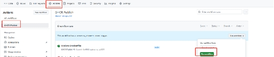

(2) HF部署：
  - 在HF新建Dockerfile，输入：
    ```dockerfile
    FROM ghcr.io/你的用户名/你克隆后的仓库名:main
    ```
   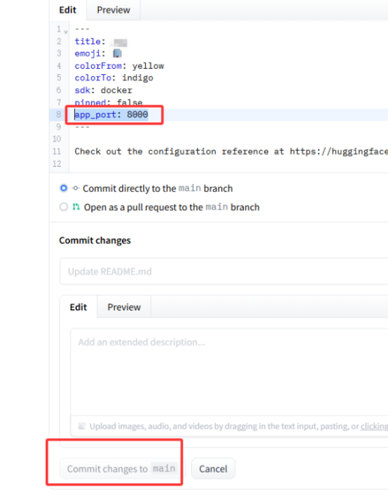
  - 修改README.md，在末尾填入：
    ```yaml
    app_port: 8000
    ```
  - 配置安全变量，添加Secrets（同上）
 等待配置完毕，时间会比较久。配置完成，酒馆启动，且插件自动安装完毕。
   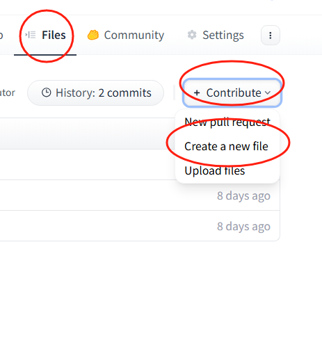

## 📱 插件使用

1. **访问酒馆**：部署完成后，访问你的酒馆地址
2. **打开插件**：通过以下URL打开插件：`你的酒馆地址/api/plugins/cloud-saves/ui`
2. 通过以下URL打开插件：`你的酒馆地址/api/plugins/cloud-saves/ui`
   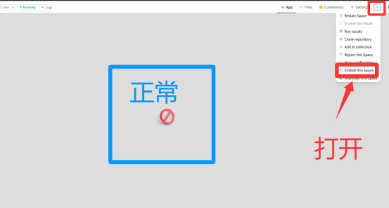
   

插件使用教程请查看@Malt老师的[教程](https://discord.com/channels/1134557553011998840/1361327099331481621)
