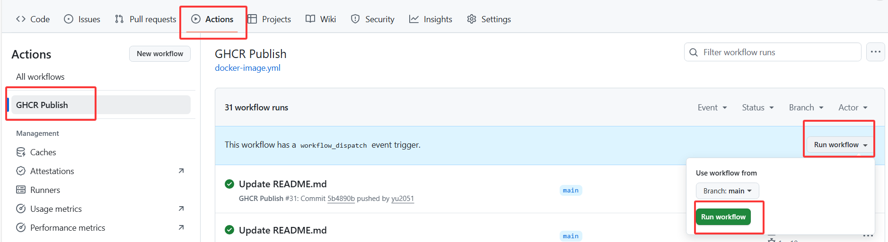

---
title: SillyTavern Jiuguan
emoji:  tavern
colorFrom: blue
colorTo: green
sdk: docker
app_port: 8000

## 插件说明

内置了@Malt的插件，部署完云酒馆后即可打开插件，无需额外安装。

插件贴：[Discord](https://discord.com/channels/1134557553011998840/1361327099331481621)

## 注意事项

- 有些人可能会出现HF拉取仓库权限失败，请查看你fork后的仓库包是否是Public，如果是private要修改权限

## 部署方法

### 方法一（麻烦但可及时更新酒馆版本）

#### 第一步：仓库配置

(0) 去fork酒馆 [https://github.com/SillyTavern/SillyTavern](https://github.com/SillyTavern/SillyTavern)，fork后的名字不要带SillyTavern类似字眼

(8~9) 打开你fork后的仓库，点击Settings，将release改为main

#### 配置变量GHCR_PAT

(10~12) 点击该仓库的Actions，创建工作流，等待工作流创建完成

#### 第二步：HF配置

- 空间命名不要出现SillyTavern类似字眼
- 修改Dockerfile配置
- (4) 将修改后的Dockerfile与entrypoint.sh、config.template.yaml一起上传
- (5~7) 修改README.md，在末尾填入app_port: 8000
- (8) 配置变量，添加Secrets：
  - Name: BASIC_AUTH_USER，Value: 输入用户名 (例如 admin)
  - Name: BASIC_AUTH_PASS，Value: 输入密码

等待配置完毕，酒馆启动后插件自动安装

### 方法二（方便但不会及时更新酒馆版本）

(1) fork仓库 [https://github.com/yu2051/yunjiu99](https://github.com/yu2051/yunjiu99)，fork后的名字不要和原名字一样或类似，不要带SillyTavern类似字眼，等待工作流结束

(2) HF部署：
  - 在HF新建Dockerfile，输入FROM ghcr.io/你的用户名/你克隆后的仓库名:main
  - 修改README.md，在末尾填入app_port: 8000
  - 配置变量，添加Secrets（同上）

## 插件使用

插件地址：你的酒馆地址/api/plugins/cloud-saves/ui

插件使用教程请查看@Malt老师的教程

---